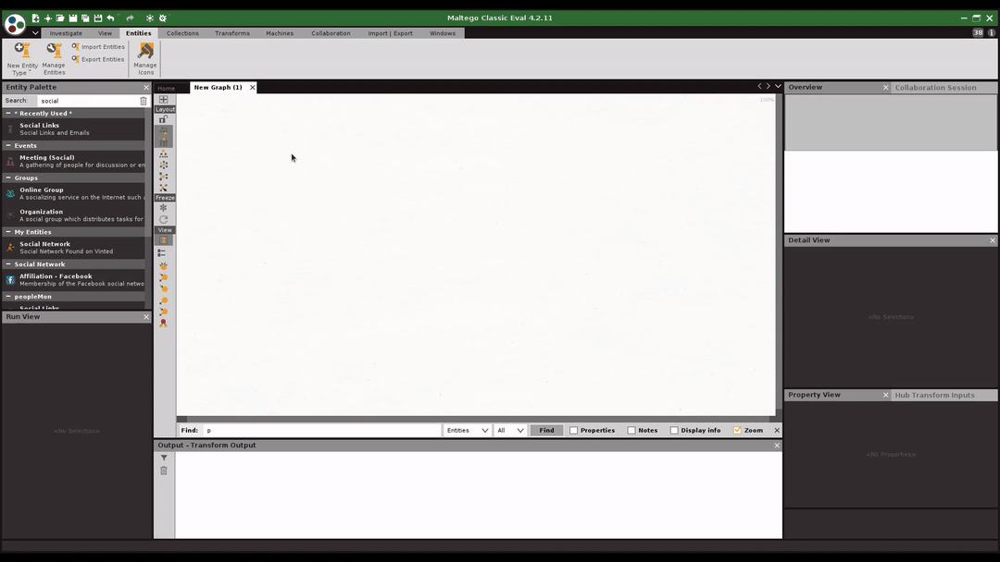

# keskivonfer-maltego
### Educational purposes only
[keskivonfer](https://github.com/megadose/keskivonfer) allows you to extract information from a vinted account  

  

## 🛠️ For the Installation check the [wiki](https://github.com/megadose/keskivonfer-maltego/wiki/Installation)  
## Démo  

## 📝 License
[GNU General Public License v3.0](https://www.gnu.org/licenses/gpl-3.0.fr.html)
